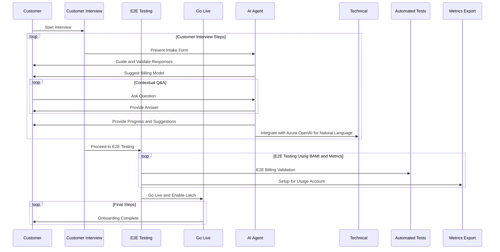

# This is MCP Server for a Task and Calendar

## Guide Recording Guidelines
- Ensure all tasks and calendar events are recorded accurately.
- Use consistent naming conventions for tasks and events.
- Regularly review and update the task and calendar entries to maintain accuracy.

## Coding Guidelines
- Follow the PEP 8 style guide for Python code.
- Use Python linters such as `pylint` or `flake8` to ensure code quality.
- Write clear and concise comments to explain complex logic.
- Use meaningful variable and function names to improve code readability.
- Test all code changes thoroughly before deployment.
- Prefer async programming for I/O-bound tasks to improve performance.
- Use uv instead of pip for package management.

## Deployment Instructions
- Ensure all dependencies are listed in the `requirements.txt` file.
- Use a virtual environment to manage dependencies.
- Run all unit tests and integration tests before deploying to production.
- Follow the version control workflow and create pull requests for code reviews.
- Document any changes in the `CHANGELOG.md` file.

## Troubleshooting
- Check server logs for error messages when issues arise.
- Verify that all required services are running.
- Use debugging tools to identify and resolve issues.
- Consult the team for assistance if the issue persists.

## Prompting Guidelines
- Use clear and concise language when prompting the user.
- Provide examples to illustrate the expected input format.
- Avoid ambiguous language that could lead to misinterpretation.
- Use a friendly and approachable tone to encourage user engagement.
- Be specific about the information needed from the user to avoid confusion.
- Include prompt md files in the .github directory.

## User interaction

Follow this sequence diagram for user interaction:



- Each partitipant in the sequence diagram represents a different role in the process. The arrows indicate the flow of communication and actions taken by each participant. The loop constructs show repeated actions or steps that may occur during the process.
- Convert each participant into an MCP server and individual actions into tools.
- The sequence diagram illustrates the flow of the customer interview process, E2E testing, and the final steps leading to the go-live phase.
- The diagram emphasizes the interaction between the customer, AI agent, and other components involved in the process.
- Sequence action name represents the prompt the user will use to interact with the tool.
```

Use FastMCP to generate the code for the sequence diagram.
```
```python
from fastmcp import FastMCP

mcp = FastMCP("Demo 🚀")

@mcp.tool()
def add(a: int, b: int) -> int:
    """Add two numbers"""
    return a + b

if __name__ == "__main__":
    mcp.run()
```